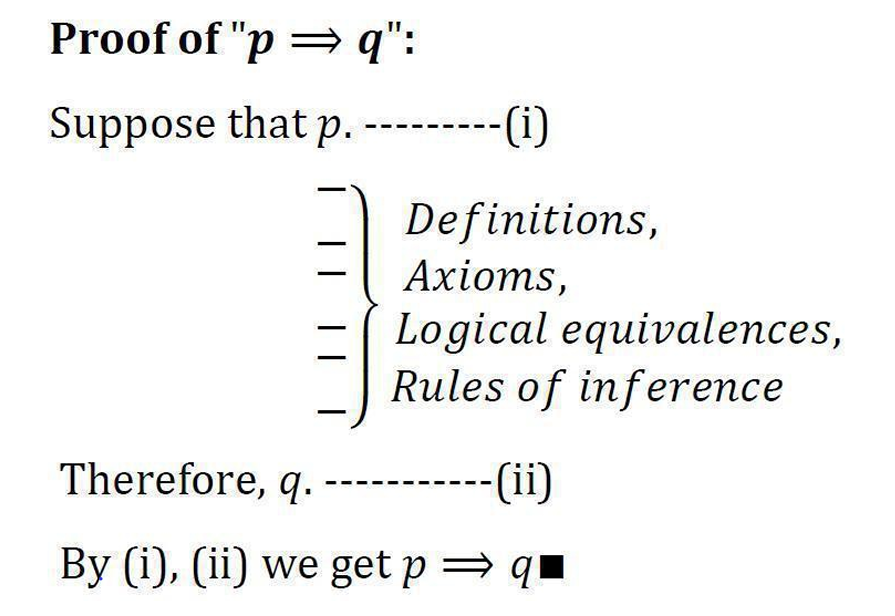
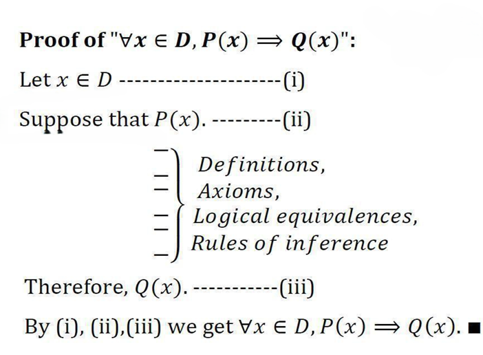
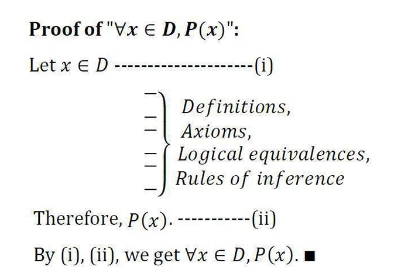
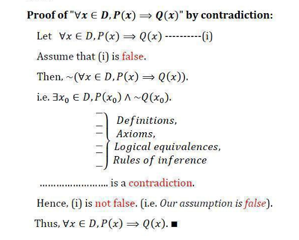
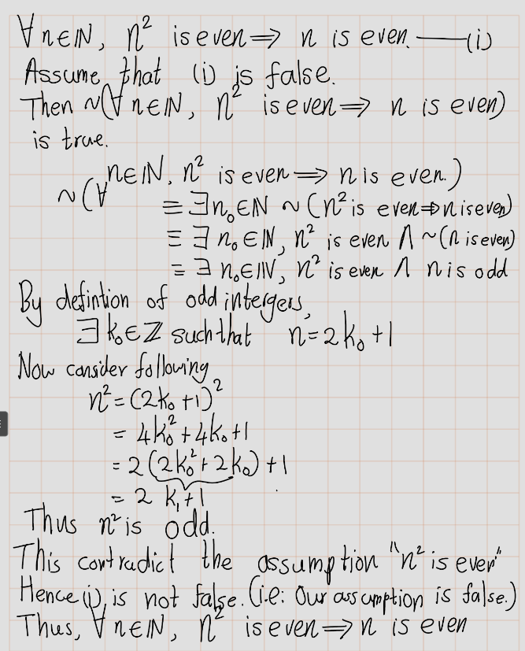

# Introduction to Proofs

### Terminology

- **Theorem**: A statement that can be shown to be true (i.e., a fact or result).
- **Proposition**: A smaller or less important theorem.
- **Axiom / Postulate**: A statement assumed to be true.
- **Lemma**: A less important theorem used in the proof of another theorem.
- **Corollary**: A less important theorem that follows from a larger theorem.
- **Conjecture**: A statement proposed as true but not yet proven.


**Note**: A **proof** is a valid argument that establishes the truth of a theorem (or any statement that can be true or false).  
Axioms and postulates do not require proof—they serve as foundational assumptions, akin to basic words in a dictionary that help define others.

## Arguments

- An **argument** is an assertion that a given set of propositions \( p_1, p_2, \ldots, p_n \), called **premises**, yields another proposition \( q \), called the **conclusion**.

- This is denoted symbolically as:
  \[
  p_1, p_2, \ldots, p_n \vdash q
  \]

- The argument is said to be **valid** if \( q \) is true whenever all the premises \( p_1, p_2, \ldots, p_n \) are true.
- An argument that is not valid is called a **fallacy**.
- The argument \( p_1, p_2, \ldots, p_n \vdash q \) is **valid** if and only if the compound proposition:
  \[
  (p_1 \land p_2 \land \ldots \land p_n) \Rightarrow q
  \]
  is a **tautology**.


```{example}
Let \( n \in \mathbb{N} \). Consider the following argument:

1. \( (-1)^n \) is positive or \( (-1)^n \) is negative.  
2. If \( (-1)^n \) is positive, then \( (-1)^{2n} > 0 \).  
3. If \( (-1)^n \) is negative, then \( (-1)^{2n} > 0 \).  

Therefore, \( (-1)^{2n} > 0 \).

Let:
- \( p \): \( (-1)^n \) is positive  
- \( q \): \( (-1)^n \) is negative  
- \( r \): \( (-1)^{2n} > 0 \)


We examine the validity of the argument:
\[
\underbrace{(p \lor q)}_{Premise},\ \underbrace{(p \Rightarrow r)}_{Premise},\ \underbrace{(q \Rightarrow r)}_{Premise} \vdash \underbrace{r}_{Conclusion}
\]

This corresponds to the compound proposition:
\[
((p \lor q) \land (p \Rightarrow r) \land (q \Rightarrow r)) \Rightarrow r
\]


| \( p \) | \( q \) | \( r \) | \( p \lor q \) | \( p \Rightarrow r \) | \( q \Rightarrow r \) | \( (p \lor q) \land (p \Rightarrow r) \land (q \Rightarrow r) \) | \( ((p \lor q) \land (p \Rightarrow r) \land (q \Rightarrow r)) \Rightarrow r \) |
|:------:|:------:|:------:|:--------------:|:---------------------:|:---------------------:|:---------------------------------------------------------------:|:--------------------------------------------------------------------------------:|
| T      | T      | T      | T              | T                     | T                     | T                                                               | T                                                                                |
| F      | T      | T      | T              | T                     | T                     | T                                                               | T                                                                                |
| T      | F      | T      | T              | T                     | T                     | T                                                               | T                                                                                |
| F      | F      | T      | F              | T                     | T                     | F                                                               | T                                                                                |
| T      | T      | F      | T              | F                     | F                     | F                                                               | F                                                                                |
| T      | F      | F      | T              | F                     | T                     | F                                                               | F                                                                                |
| F      | T      | F      | T              | T                     | F                     | F                                                               | F                                                                                |
| F      | F      | F      | F              | T                     | T                     | F                                                               | T                                                                                |


This table confirms that the compound proposition is **not** a tautology, hence the argument is **not valid** in all cases. However, in the specific example from Section 8.3, the premises are true and the conclusion follows, so the argument is valid **in that instance**, though not universally.


```


## Valid Argument


By definition, a argument is **valid** if:
> If the premises are true, then the conclusion is true.

This corresponds to the tautology:
\[
((p \Rightarrow q) \land p) \Rightarrow q
\]


```{example}
Premises:
1. \( p \Rightarrow q \)
2. \( p \)

Conclusion:
∴ \( q \)
```


```{example}
Is the following argument valid?

Premises:
1. If the door is open, then I must close it.
2. The door is open.

Conclusion:
∴ I must close it.

Let:
- \( p \): The door is open  
- \( q \): I must close it

This matches the form:
\[
(p \Rightarrow q),\ p \vdash q
\]

Since the compound proposition \(((p \Rightarrow q) \land p) \Rightarrow q\) is a tautology, the argument is valid.
```


We consider the argument:

\[
[(p \Rightarrow q) \land p] \Rightarrow q
\]

This structure represents a **valid argument**, often referred to as a **rule of inference**.


#### Method 1: Truth Table

| \( p \) | \( q \) | \( [(p \Rightarrow q) \land p] \Rightarrow q \) |
|:-------:|:-------:|:----------------------------------------------:|
| T       | T       | T                                              |
| T       | F       | T                                              |
| F       | T       | T                                              |
| F       | F       | T                                              |

This confirms that the compound proposition is **not always true**, but when both premises are true, the conclusion follows — hence the argument is valid in that case.

---

#### Method 2: Direct Reasoning

If:

- \( p \) is true, and
- \( p \Rightarrow q \) is true,

Then:

- \( q \) must be true.


```{remark}
A **logical rule of inference** is defined to be any valid argument — that is, one where the conclusion necessarily follows from the premises.
```

(i) Modus Ponens
This rule affirms the consequent based on a conditional and its antecedent:
\[
\begin{array}{ll}
p \Rightarrow q & \text{(premise 1)} \\
p & \text{(premise 2)} \\
\hline
q & \text{(conclusion)}
\end{array}
\]
If "p implies q" and "p" is true, then "q" must also be true.

```{example}
**Claim:**\(\sqrt{2} < \sqrt{3}\)

\begin{align}
  2<3 & \implies 2-3<0\\
  & \implies  (\sqrt{2} - \sqrt{3})(\sqrt{2} + \sqrt{3})<0\\
  &\implies (\sqrt{2} - \sqrt{3})<0\\
  & \implies \sqrt{2}  < \sqrt{3}                                     \end{align}
```

(ii) Modus Tollens
This rule denies the antecedent based on a conditional and the negation of its consequent:
\[
\begin{array}{ll}
p \Rightarrow q & \text{(premise 1)} \\
\neg q & \text{(premise 2)} \\
\hline
\neg p & \text{(conclusion)}
\end{array}
\]
If "p implies q" and "q" is false, then "p" must also be false.

```{example}
**Claim:** \(\sqrt{2}+\sqrt{3}<\sqrt{11}\)


\begin{align} 
\sqrt{2}+\sqrt{3}\geq \sqrt{11} & \implies (\sqrt{2}+\sqrt{3})^2<(\sqrt{11}) \text{Since }\sqrt{2}+\sqrt{3}\geq 11>0\\
& \implies 2+2\sqrt{6}+3\geq 11\\
& \implies 5+2\sqrt{6}\geq 11\\
& \implies 2\sqrt{6}\geq 6\\
& \implies 4\times 6 \geq 36 \text{ Since } 4\times 6 \geq 36>0\\
\underbrace{\sqrt{2}+\sqrt{3}\geq \sqrt{11}}_p& \implies \underbrace{24 \geq 36}_q \text{ is true}  (\#eq:eq1)\\\\
\text{But } 24 < 36 &\text{ is true}\\
\therefore 24 \geq 36 &\text{ is false}\\
\therefore \underbrace{\neg(24 \geq 36)}_{\neg q} &\text{ is true}(\#eq:eq2)\\
\therefore \neg p &\\
\text{ i.e. } \sqrt{2}+\sqrt{3}<\sqrt{11}&
\end{align}


```

## Mathematical proofs

There are several standard techniques used to establish mathematical theorems. Below are five commonly used methods:

1. Direct proofs
2. Proof by Contradiction
3. Indirect proofs
4. proof by cases
5. Proof by Principle of Mathematical Induction

### Direct proofs
Direct proof is probably the easiest approach to establish the theorems, as it does not require knowledge of any special techniques. The argument is constructed using a series of simple statements, where each one should follow directly from the previous one. It is important not to miss out any steps as this may lead to a gap in reasoning. To prove the hypothesis, one may use axioms, as well as the previously established statements of different theorems.


#### Proving Conditional Statements: \(p\implies q\)

- If $p$ is **false**, then the **implication** is always
Thus, show that if $p$ is true, then $q$ is true.

- *Direct Proof*: Assume that $p$ is true. Use rules of inference, axioms, and logical equivalences to show that $q$ must also be true.

Proof of "$p \Rightarrow q$":
<center>
{width=60%}
</center>

Before we begin exploring example proofs, it's essential to clearly define the foundational terms we'll be using. Based on your notes and the image provided, here are the formal definitions:

```{definition,name='Even and Odd Integers'}
- An integer \( n \) is **even** if there exists an integer \( k \in \mathbb{Z} \) such that:
  \[
  n = 2k
  \]
- An integer \( n \) is **odd** if there exists an integer \( k \in \mathbb{Z} \) such that:
  \[
  n = 2k + 1
  \]
- Every integer is either even or odd, and no integer is both.
```

```{example}
$5$ is odd integer and $10$ is even integer.

- Since $5=2\times 2 +1$
- Since $10=2\times 5$
```
```{definition,name='Divisibility'}
A integer $b \neq 0 $  **\( b \) divides another integer \( a \)**  if:
  \(
  \exists k \in \mathbb{Z} \text{ such that } a = k \cdot b
  \)
** Notation**: $b\neq 0$ divides $a$ , written \( b \mid a \))

In this case, \( b \) is called a **factor** or **divisor** of \( a \).
```


```{example}
- \( 3 \mid 12 \) because \( 12 = 4 \cdot 3 \)
- \( 5 \nmid 12 \) because there is no integer \( k \) such that \( 12 = 5k \)
```

```{example}
Give a direct proof of the theorem "If $n$ is an odd integer, then $n^2$ is odd."
```

```{proof}
Let \( n \in \mathbb{Z} \) be an odd integer.  
By definition of oddness, there exists an integer \( k \in \mathbb{Z} \) such that:
\[
n = 2k + 1
\]

Now compute \( n^2 \):
\[
n^2 = (2k + 1)^2 = 4k^2 + 4k + 1 = 2(2k^2 + 2k) + 1
\]

Let \( m = 2k^2 + 2k \in \mathbb{Z} \). Then:
\[
n^2 = 2m + 1
\]

Thus, \( n^2 \) is of the form \( 2m + 1 \), which is odd.


```


```{theorem}
Let $n$ and $m$ be integers. Then

i. if $n$ and $m$ are both even, then $n + m$ is even,
ii. if $n$ and $m$ are both odd, then $n + m$ is even,
iii. if one of $n$ and $m$ is even and the other is odd, then $n + m$ is odd.
```

**Claim 1:** If \( n \) and \( m \) are both even, then \( n + m \) is even.

```{proof}  
If \( n \) and \( m \) are even, then there exist integers \( a, b \in \mathbb{Z} \) such that:
\[
n = 2a,\quad m = 2b
\]
Then:
\[
n + m = 2a + 2b = 2(a + b)
\]
Since \( a + b \in \mathbb{Z} \), \( n + m \) is divisible by 2, hence even.

```

**Claim 2:** If \( n \) and \( m \) are both odd, then \( n + m \) is even.

```{proof}
If \( n \) and \( m \) are odd, then there exist integers \( a, b \in \mathbb{Z} \) such that:
\[
n = 2a + 1,\quad m = 2b + 1
\]
Then:
\[
n + m = (2a + 1) + (2b + 1) = 2a + 2b + 2 = 2(a + b + 1)
\]
Since \( a + b + 1 \in \mathbb{Z} \), \( n + m \) is even.

```

**Claim 3:** If one of \( n \) and \( m \) is even and the other is odd, then \( n + m \) is odd.

```{proof}  
Assume without loss of generality that \( n \) is even and \( m \) is odd.  
Then there exist integers \( a, b \in \mathbb{Z} \) such that:
\[
n = 2a,\quad m = 2b + 1
\]
Then:
\[
n + m = 2a + (2b + 1) = 2(a + b) + 1
\]
Since \( a + b \in \mathbb{Z} \), \( n + m \) is of the form \( 2k + 1 \), hence odd.
```

Consider the following definitions

- A integer\( a \in \mathbb{Z} \).  said to be Type 0: if there exist integr $n$ such that \( a = 3n \).
- A integer\( a \in \mathbb{Z} \).  said to be Type 1: if there exist integr $n$ such that \( a = 3n+1 \).
- A integer\( a \in \mathbb{Z} \).  said to be Type 2: if there exist integr $n$ such that \( a = 3n+2 \).


(i) If \( a \) and \( b \) are both type 1 integers, then \( a + b \) is a type 2 integer.

```{proof} 
Let \( a = 3m + 1 \) and \( b = 3n + 1 \) for some \( m, n \in \mathbb{Z} \).  
Then:
\[
a + b = (3m + 1) + (3n + 1) = 3(m + n) + 2
\]
So \( a + b \) is of the form \( 3k + 2 \), hence type 2.

```
(ii) If \( a \) and \( b \) are both type 2 integers, then \( a + b \) is a type 1 integer.

```{proof}
Let \( a = 3m + 2 \) and \( b = 3n + 2 \) for some \( m, n \in \mathbb{Z} \).  
Then:
\[
a + b = (3m + 2) + (3n + 2) = 3(m + n) + 4 = 3(m + n + 1) + 1
\]
So \( a + b \) is of the form \( 3k + 1 \), hence type 1.

```

(iii) If \( a \) is type 1 and \( b \) is type 2, then \( ab \) is type 2.

```{proof} 
Let \( a = 3m + 1 \), \( b = 3n + 2 \) for some \( m, n \in \mathbb{Z} \).  
Then:
\[
ab = (3m + 1)(3n + 2) = 9mn + 6m + 3n + 2 = 3(3mn + 2m + n) + 2
\]
So \( ab \) is of the form \( 3k + 2 \), hence type 2.

```

**NOte**:  
- Many logical theorems take the form:  
  \[
  \forall x (P(x) \Rightarrow Q(x))
  \]


1. **Choose an Arbitrary Element**:  
   Let \( c \) be an arbitrary element from the domain.

2. **Prove the Implication for \( c \)**:  
   Show that \( P(c) \Rightarrow Q(c) \) holds.

3. **Apply Universal Generalization**:  
   Since \( c \) was arbitrary, we conclude:  
   \[
   \forall x (P(x) \Rightarrow Q(x))
   \]

4. **Focus of the Proof**:  
   The core task is to prove a statement of the form:  
   \[
   p \Rightarrow q
   \]

{width=60%}
```{example}
Prove that for all $n \in \mathbb{N} , if $n$ is even, then $n^2$ is even.\
i.e. Prove that " $\forall n \in  \mathbb{N}, n$ is even is even."
```

```{proof}
Let \( n \in \mathbb{N} \).\
Suppose \( n \) is even.  
By definition of evenness, there exists an integer \( k \in \mathbb{N} \) such that:\(n = 2k\)

Now,
\[
n^2 = (2k)^2 = 4k^2 = 2(2k^2)
\]

Since \( 2k^2 \in \mathbb{N} \), it follows that \( n^2 \) is divisible by 2, hence even.
```


{width=60%}


```{example}
Prove that $x^2 + 6x + 10 > 0$, where $x$ is a real number.\
We need to proove that  : $\forall x \in \mathbb{R},x^2 + 6x + 10 > 0$
```

```{proof}
Let $x\in \mathbb{R}$.\
First note that $x^2 + 6x + 10 = (x + 3)^2 + 1$
\[
\begin{align}
(x+3)^2 & \geq 0\\
(x+3)^2+1 & \geq 1>0
\end{align}
\]

Threfore, $\forall x \in \mathbb{R},x^2 + 6x + 10 > 0$
```

### Proof by Contradiction

Given a statement $p$, assume it is false.\
Assume$\neg p$.\
Prove that $\neg p$ leads to false.\
A contradiction exists.\


- Given a statement of the form $p \implies q$.
To assume it's false, you only have to consider the case where $p$ is true and $q$ is false.



**Claim:** If $n^2$ is even, then $n$ is even.

<center>

</center>

```{example}
Prove: \(\forall  x \in \mathbb{R}, x^2 + 6x + 10 > 0 \)
```

```{proof}
Suppose that 
begin{equation}
\forall  x \in \mathbb{R}, x^2 + 6x + 10 > 0 (\#eq:eq5)
\end{equation}
Assume that statement \@ref(eq:eq5) is false. \ 
\(x_0^2 + 6x_0 + 10 \leq 0\) for some \(x_0 \in \mathbb{R})\).\
Now \(x_0^2 + 6x_0 + 10 =(x_0+3)^2+1\geq 1\).\
Hence, \(0<1\leq 0\). This is a contradiction.\
$\therefore$  \@ref(eq:eq5) is false.\
\(\forall  x \in \mathbb{R}, x^2 + 6x + 10 > 0\)
```

```{exercise}
**Claim:** If \( n = ab \), then \( a \leq \sqrt{n} \) or \( b \leq \sqrt{n} \), where \( a, b \in \mathbb{Z}^+ \).\
\(\exists x_0 \in \mathbb{R}\) such that \(x_0^2 + 6x_0 + 10 \leq 0\).
```

```{exercise}
**Claim:** \( \sqrt{2} \notin \mathbb{Q} \), where \(\mathbb{Q}=\left\{\frac{p}{q}:p,q \in \mathbb{Z}, q\neq 0\right\}\)
```

## Indirect Proofs

Consider an implication:


\[
p \Rightarrow q
\]


Its contrapositive is:


\[
\neg q \Rightarrow \neg p
\]


This contrapositive is logically equivalent to the original implication.  
Thus, to prove \( p \Rightarrow q \), we may instead prove \( \neg q \Rightarrow \neg p \).

To perform an **indirect proof**, carry out a **direct proof** on the contrapositive.


```{example}
Prove that: If \( x^2 \) is even, then \( x \) is even.
```

```{example}
Prove that:  If \( (x - 2)^2 \neq 1 \), then \( x \neq 3 \)
```

## Proof by Cases

```{example}

Let \( x \) be any integer. Then \( x^2 + x \) is even.
```


To prove: \(\exists x \in \mathbb{Z},\; P(x)\)

We exhibit a member of the universal set for which \( P(x) \) is true.  
One example suffices.


```{example}


Show that:


\[
\exists x \in \mathbb{Z} \text{ such that } x^2 = 4
\]
```

```{proof}
Let \( x_0 = -2 \). Then:
- \( x_0 \in \mathbb{Z} \)
- \( x_0^2 = (-2)^2 = 4 \)

Thus, \(\exists x_0 \in \mathbb{Z},\quad x_0^2 = 4\)
```

## Proof by Principle of Mathematical Induction

### Principle of Mathematical Induction

Let \( P(n) \) be a statement defined for each positive integer \( n \in \mathbb{N} \).  
To prove that \( P(n) \) is true for all \( n \in \mathbb{N} \), it suffices to show:

1. **Base Case**:  
   \( P(1) \) is true.

2. **Inductive Step**:  
   For every \( k \in \mathbb{N} \), if \( P(k) \) is true, then \( P(k+1) \) is also true.  
   That is:
\[   \forall k \in \mathbb{N},\; P(k) \Rightarrow P(k+1)\]

3. **Conclusion**: If both the base case and the inductive step are established, then:
\[
\forall n \in \mathbb{N},\; P(n) \text{ is true}
\]


This is the foundation for proving propositions over the natural numbers.


```{example}  
Prove by induction that  
\[
1 + 2 + 3 + \cdots + n = \frac{n(n+1)}{2}
\quad \text{for all } n \in \mathbb{N}.
\]
```
```{example}  
Prove by induction that  
\[
n^3 + 2n \text{ is divisible by } 3
\quad \text{for all } n \in \mathbb{N}.
\]
```

## Exercises

```{exercise}  
Prove by induction that  
\[
2^{n+1} > n^2
\quad \text{for all } n \in \mathbb{N}.
\]
```

```{exercise} 
Let the sequence \( (a_n) \) be defined recursively by  
\[
a_1 = \sqrt{2}, \quad a_{n+1} = \sqrt{2 + a_n}, \quad \text{for all } n \in \mathbb{N}.
\]

Prove the following properties:

(a) \( a_n > 0 \) for all \( n \in \mathbb{N} \).  
(b) \( a_n \leq 2 \) for all \( n \in \mathbb{N} \).  
(c) \( a_{n+1} \geq a_n \) for all \( n \in \mathbb{N} \).

```