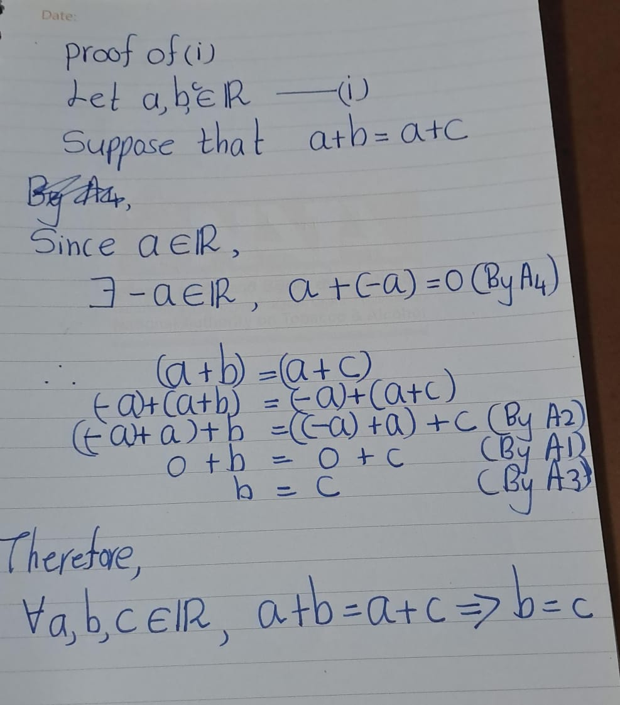
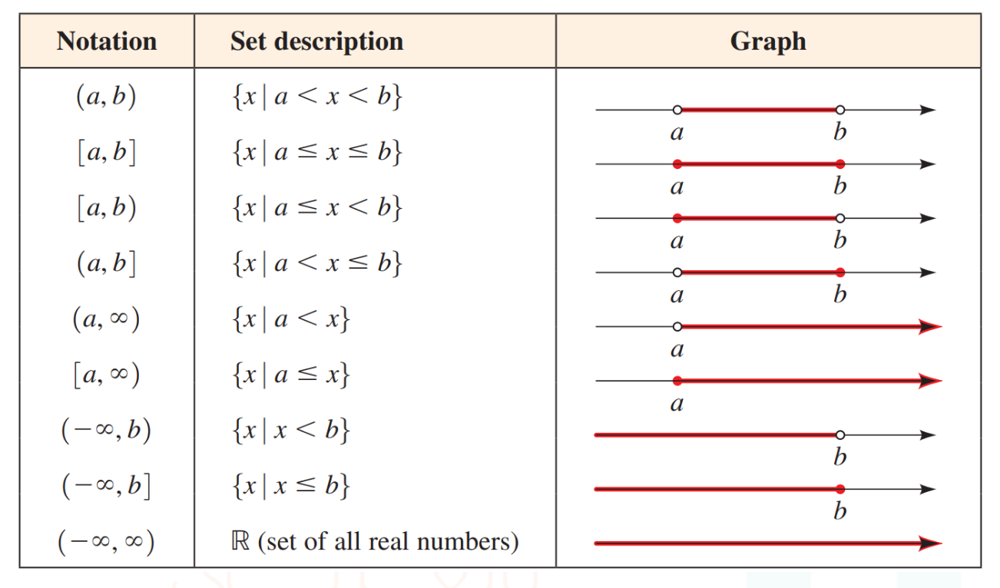

# The Real Number System \( \mathbb{R} \)

### Topics Covered

- Axioms of Real Numbers  
- Order Axioms and Axiom of Bounds  
- Supremum and Infimum of Subsets of \( \mathbb{R} \)  
- Concept of Infinity and Intervals of \( \mathbb{R} \)


### What Are the Real Numbers?

The question "What are the real numbers?" is, for now, too deep to answer directly. Instead, we adopt a formal approach: we assume the existence of a set \( \mathbb{R} \), called the set of real numbers, and impose a collection of axioms that define its structure.

All subsequent mathematical development will be based solely on these axioms.

## Axioms of real numbers

We assume that there are two binary operations on \(\mathbb{R}\), that is, "\(+\)" and "\(\cdot\)" the first called **addition**, and second **multiplication**, such that $a + b \in \mathbb{R}$ and $a\cdot b \in \mathbb{R}$  for all $a, b \in \mathbb{R}$, and the following properties are satisfied:


**A1. Commutativity of Addition**  
For all \( a, b \in \mathbb{R} \), .\(
a + b = b + a
\)

**A2. Associativity of Addition**  
For all \( a, b, c \in \mathbb{R} \), \(
a + (b + c) = (a + b) + c
\)

**A3. Existence of Additive Identity**  
There exists an element \( 0 \in \mathbb{R} \) such that for all \( a \in \mathbb{R} \),  \(
a + 0 = a
\)

**A4. Existence of Additive Inverse**  
For every \( a \in \mathbb{R} \), there exists an element \( -a \in \mathbb{R} \) such that:  \(a + (-a) = 0\)


**A5. Commutativity of Multiplication**  
For all \( a, b \in \mathbb{R} \),  \(a \cdot b = b \cdot a\)

**A6. Associativity of Multiplication**  
For all \( a, b, c \in \mathbb{R} \),  \(a \cdot (b \cdot c) = (a \cdot b) \cdot c\)

**A7. Existence of Multiplicative Identity**  
There exists an element \( 1 \in \mathbb{R} \) such that for all \( a \in \mathbb{R} \),  \(a \cdot 1 = a\)

**A8. Existence of Multiplicative Inverse**  
For every \( a \in \mathbb{R} \) with \( a \ne 0 \), there exists an element \( a^{-1} \in \mathbb{R} \) such that:  \(a \cdot a^{-1} = 1\)

**A9. Distributivity of Multiplication over Addition**  
For all \( a, b, c \in \mathbb{R} \),\(a \cdot (b + c) = a \cdot b + a \cdot c
\)


## Basic Properties of Equality

Let \( x, y, z \in \mathbb{R} \). Then:

1. **Reflexivity**:  
   \[
   x = x
   \]

2. **Symmetry**:  
   If \( x = y \), then \( y = x \).

3. **Transitivity**:  
   If \( x = y \) and \( y = z \), then \( x = z \).


## Some Algebraic Properties of Real Numbers

Let \( a, b, c \in \mathbb{R} \). Then:

i. **Cancellation Law for Addition**:  
   If \( a + b = a + c \), then \( b = c \).

ii. **Multiplication by Zero**:  
   \[
   a \cdot 0 = 0
   \]

iii. **Zero Product Property**:  
   If \( a \cdot b = 0 \), then \( a = 0 \) or \( b = 0 \).

```{proof}
.\
<center>
{width=80%}
</center>
rest of them leave as an exercise
```


### Selected Theorems

These theorems follow from the axioms of the real numbers. In all cases, \( a, b, c, d \in \mathbb{R} \), with additional nonzero conditions where specified.

1. Properties of Zero

    a. \( a - a = 0 \)
    a. \( 0 = -a + a \)
    a. \( 0 \cdot a = 0 \)
    a. If \( ab = 0 \), then \( a = 0 \) or \( b = 0 \)

2. Properties of Signs

    a. \( -0 = 0 \)
    a. \( -(-a) = a \)
    a. \( (-a)b = -(ab) = a(-b) \)
    a. \( (-a)(-b) = ab \)
    a. \( -a = (-1)a \)

3. Additional Distributive Properties

    a. \( -(a + b) = -a - b \)
    a. \( a - b = -(b - a) \)
    a. \( -(a - b) = b - a \)
    a. \( a + a = 2a \)
    a. \( a(b - c) = ab - ac = (b - c)a \)
    a. \( (a + b)(c + d) = ac + ad + bc + bd \)
    a. \( (a + b)(c - d) = ac - ad + bc - bd = (c - d)(a + b) \)
    a. \( (a - b)(c - d) = ac - ad - bc + bd \)

4. Properties of Inverses (for \( a, b \ne 0 \))

    a. If \( a \ne 0 \), then \( a^{-1} \ne 0 \)
    a. \( 1^{-1} = 1 \)
    a. \( (a^{-1})^{-1} = a \)
    a. \( (-a)^{-1} = -(a^{-1}) \)
    a. \( (ab)^{-1} = a^{-1}b^{-1} \)
    a. \( \left( \frac{a}{b} \right)^{-1} = \frac{b}{a} \)


5. Properties of Quotients (for nonzero denominators)

    a. \( \frac{a}{1} = a \)
    a. \( \frac{1}{a} = a^{-1} \)
    a. \( \frac{a}{a} = 1 \)
    a. \( \frac{a/b}{c/d} = \frac{ac}{bd} \)
    a. \( \frac{a/b}{c/d} = \frac{ad}{bc} \)
    a. \( \frac{ac}{bc} = \frac{a}{b} \)
    a. \( \frac{a}{b/c} = \frac{ab}{c} \)
    a. \( \frac{ab}{b} = a \)
    a. \( \frac{-a}{b} = -\left( \frac{a}{b} \right) = \frac{a}{-b} \)
    a. \( \frac{-a}{-b} = \frac{a}{b} \)
    a. \( \frac{a}{b} + \frac{c}{d} = \frac{ad + bc}{bd} \)
    a. \( \frac{a}{b} - \frac{c}{d} = \frac{ad - bc}{bd} \)

```{exercise}
Proove theroms
```


## The Order Axioms and Axiom of Bounds

We assume the existence of a subset \( P \subseteq \mathbb{R} \) with the following properties:


**A10.** For any \( a \in \mathbb{R} \), exactly one of the following holds:
\( a \in P \text{ or }  a = 0 \text{ or } -a \in P \)

**A11.** If \( a, b \in P \), then \( a + b \in P\) and \(a \cdot b \in P \)

```{definition}
For any \( a, b \in \mathbb{R} \), we define:
\[
a > b \quad \text{if and only if} \quad a - b \in P
\]

Equivalently, \( b < a \).
```


**Note**: Axioms A10 and A11, together with Axioms A1–A9, endow the field \( (\mathbb{R}, +, \cdot) \) with an order structure.  
Thus, \( \mathbb{R} \) becomes an **ordered field**.


```{exercise}  
Prove that for all \( a \in P \), we have \( a > 0 \).
```

```{exercise} 
Prove that \( 1 \in P \), i.e., \( 1 > 0 \).
```

```{exercise}  
Prove that if \( a > 0 \), then \( x_a > 0 \) for all \( a \in \mathbb{R} \).

```

```{theorem}
For any two real numbers \( a, b \), exactly one of the following holds:
- \( a < b \text{ or } b < a \text{ or } a = b \)
```


```{theorem,name='Order Properties of Real Numbers'}

Let \( a, b, c \in \mathbb{R} \). Then:

1. **Transitivity**  
   If \( a < b \) and \( b < c \), then \( a < c \).

2. **Addition Preservation**  
   If \( a < b \), then \( a + c < b + c \).

3. **Multiplication by Positive**  
   If \( c > 0 \) and \( a < b \), then \( a \cdot c < b \cdot c \).

4. **Multiplication by Negative**  
   If \( c < 0 \) and \( a < b \), then \( a \cdot c > b \cdot c \).  
   *(Note: This reverses the inequality.)*
```

## Absolute Value

```{definition}
For any real number \( x \), the absolute value (or modulus) of \( x \) is defined as:
\[
|x| = 
\begin{cases}
x, & \text{if } x \geq 0 \\
-x, & \text{if } x < 0
\end{cases}
\]

```

```{theorem,name='Properties of Absolute Value'} 
Let \( a, b \in \mathbb{R} \). Then:

1. \( |a| = 0 \iff a = 0 \)
2. \( |a| \geq 0 \)
3. \( |a| = |-a| \)
4. \( -|a| \leq a \leq |a| \)
5. If \( b > 0 \), then \( |a| \leq b \iff -b \leq a \leq b \)
6. If \( b > 0 \), then \( |a| \geq b \iff a \geq b \) or \( a \leq -b \)
7. \( |a + b| \leq |a| + |b| \)
```

*Proof*: Leave as a exercise


```{example}

1. If \( a < b \) and both \( a, b > 0 \), then \( a^{-1} > b^{-1} \).
2. \( ab > 0 \iff a, b \) are both positive or both negative.
3. \( ab < 0 \iff \) one of \( a, b \) is positive and the other is negative.

```

```{definition,name='Minimum and Maximum'}

Let \( A \subseteq \mathbb{R} \) be a non-empty set.

- An element \( m \in A \) is called the **minimum** of \( A \) if:\(
  m \leq x \quad \text{for all } x \in A
  \)

- An element \( M \in A \) is called the **maximum** of \( A \) if:\(
  M \geq x \quad \text{for all } x \in A
  \)
```
**Note:** If a minimum or maximum exists, it is unique.


```{example}

Let \( A = \{2, -3, 8, 17, -5\} \)

- **Minimum of \( A \)**:  
\( \min A = -5 \). (Because \(
  2 \geq -5,
  -3\geq -5, 
  8 \geq -5,
  17\geq -5, 
  -5 \geq -5\)).

- **Maximum of \( A \)**:  
\( \max A = 17 \). (Because \(
  2 \leq 17,
  -3\leq 17, 
  8 \leq 17,
  17\leq 17, 
  -5 \leq 17\))
```


```{example}

Let \( A = \{1 + \frac{2}{n} \mid n \in \mathbb{N} \} \)

This is an infinite set of real numbers:
\[
A = \left\{1 + \frac{2}{1}, 1 + \frac{2}{2}, 1 + \frac{2}{3}, \dots \right\} = \left\{3, 2, \frac{5}{3}, \dots \right\}
\]
```

<!--**Maximum of \( A \)**:  
  The largest value occurs when \( n = 1 \):  
  \[
  1 + \frac{2}{1} = 3
  \]  
  But the question says “Show that maximum of \( A \) is 2.”  
  This is incorrect unless the set is defined differently. If instead:
  \[
  A = \left\{1 + \frac{1}{n} \mid n \in \mathbb{N} \right\}
  \]
  then the maximum is \( 2 \) (when \( n = 1 \)). Please confirm the intended definition.

- **Minimum of \( A \)**:  
  As \( n \to \infty \), \( \frac{2}{n} \to 0 \), so:
  \[
  \inf A = 1
  \]
  But there is no \( n \in \mathbb{N} \) such that \( 1 + \frac{2}{n} = 1 \), so the minimum does **not** exist in \( A \).
-->


```{definition,name='Bounded Above'}

A non-empty set \( A \subseteq \mathbb{R} \) is said to be **bounded above** if there exists a number \( k \in \mathbb{R} \) such that:\(
\forall x \in A, \quad x \leq k\)

The number \( k \) is called an **upper bound** of the set \( A \).
```


```{definition,name='Bounded Below'}

A non-empty set \( A \subseteq \mathbb{R} \) is said to be **bounded below** if there exists a number \( k \in \mathbb{R} \) such that:

\[
\forall x \in A, \quad x \geq k
\]

The number \( k \) is called a **lower bound** of the set \( A \).
```


**Note:**
Let \( M \subseteq d \) and \( A \subseteq \mathbb{R} \).

- A set \( A \) is bounded above \(\underbrace{\iff}_{\text{Def}^\text{n}}
\exists k \in \mathbb{R} \quad \forall x \in A, \quad x \leq k
\)

- A set \( A \) is **not** bounded above \(\iff \neg (\exists k \in \mathbb{R} \quad \forall x \in A, \quad x \leq k)\equiv\forall k \in \mathbb{R} \quad \exists x \in A, \quad x > k
\)

```{example}
Let \( A = \{ x \in \mathbb{R} \mid x \geq -7 \} \) and \( B = \{ 2n + 3 \mid n \in \mathbb{N} \} \)
```


**Note:**
Let \( M \subseteq d \) and \( A \subseteq \mathbb{R} \).

- A set \( A \) is bounded below \(\underbrace{\iff}_{\text{Def}^\text{n}}
\exists k \in \mathbb{R} \quad \forall x \in A, \quad x \geq k
\)

- A set \( A \) is **not** bounded below \(\iff \neg (\exists k \in \mathbb{R} \quad \forall x \in A, \quad x \geq k)\equiv\forall k \in \mathbb{R} \quad \exists x \in A, \quad x > k
\)


```{definition}
Let \( A \subseteq \mathbb{R} \), with \( A \neq \emptyset \).

- A set \( A \) is **bounded** if it is both bounded above and bounded below.
- A set \( A \) is **unbounded** if it is not bounded.
```

```{definition,name='Least Upper Bound (Supremum)'}

An element \( \lambda \in \mathbb{R} \) is called the **least upper bound** (or **supremum**) of \( A \) if:

1. \( \lambda \) is an upper bound of \( A \), i.e.,
   \[
   \forall x \in A, \quad x \leq \lambda
   \]
2. No upper bound of \( A \) is less than \( \lambda \), i.e.,
   \[
   \forall u \in \mathbb{R}, \left( \forall x \in A, \ x \leq u \right) \Rightarrow \lambda \leq u
   \]
```

```{definition,name='Greatest Lower Bound (Infimum)'}

An element \( \mu \in \mathbb{R} \) is called the **greatest lower bound** (or **infimum**) of \( A \) if:

1. \( \mu \) is a lower bound of \( A \), i.e.,
   \[
   \forall x \in A, \quad x \geq \mu
   \]
2. No lower bound of \( A \) is greater than \( \mu \), i.e.,
   \[
   \forall u \in \mathbb{R}, \left( \forall x \in A, \ x \geq u \right) \Rightarrow \mu \geq u
   \]
```


## Axiom of Bound (Completeness Axiom)

**A12. Least Upper Bound Axiom**

If \( A \subseteq \mathbb{R} \) is non-empty and bounded above, then:

\[
\exists \sup A \in \mathbb{R}
\]

That is, every non-empty subset of \( \mathbb{R} \) that is bounded above has a **least upper bound** (supremum) in \( \mathbb{R} \).

**A12′. Greatest Lower Bound Axiom**

If \( A \subseteq \mathbb{R} \) is non-empty and bounded below, then:

\[
\exists \inf A \in \mathbb{R}
\]

That is, every non-empty subset of \( \mathbb{R} \) that is bounded below has a **greatest lower bound** (infimum) in \( \mathbb{R} \).

```{example}

Let \(A = \{ x \in \mathbb{R} \mid x^2 < 2 \} \)

- This set is **bounded above**.
- The least upper bound (supremum) of \( A \) is:

  
\[
\sup A = \lambda
\]

Since:

\[
\sqrt{2}^2 = 2 \quad \text{and} \quad \sqrt{2} \in \mathbb{R}
\]
```


## Archimedean Property

```{theorem,name='Archimedean Property'}
For all \( a \in \mathbb{R}^+ \) and \( b \in \mathbb{R} \), there exists \( n \in \mathbb{N} \) such that: \(na \geq b\)
```

```{proof}

Suppose the Archimedean Property is false. 
Then\(
\exists a \in \mathbb{R}^+, \exists b \in \mathbb{R}, \forall n \in \mathbb{N}, \quad na \leq b\)

Define the set \(
S := \{ na \mid n \in \mathbb{N} \}\)

Then \( b \) is an upper bound of \( S \). By the completeness axiom, the supremum \( s_0 := \sup S \) exists.

Let \( n \in \mathbb{N} \). Then \( n + 1 \in \mathbb{N} \), and \(s_0 \geq (n + 1)a = na + a \Rightarrow s_0 - a \geq na\)

So \( s_0 - a \) is an upper bound of \( S \), but \(
s_0 - a < s_0 \)

This contradicts the fact that \( s_0 \) is the least upper bound of \( S \). Hence, the Archimedean Property holds. 
```

```{corollary}
For any \( x \in \mathbb{R} \) with \( x > 0 \), there exists \( n \in \mathbb{N} \) such that \(\frac{1}{n} < x\)

```

```{proof}

Let \( a = x \), \( b = 1 \). Since \( a > 0 \), by the Archimedean Property, there exists \( n \in \mathbb{N} \) such that:

\[
na > 1 \Rightarrow x > \frac{1}{n}
\]

```


## Concept of Infinity and Intervals of \( \mathbb{R} \)

###  Concept of Infinity
<center>
{width=20%}
</center>

Infinity comes from the Latin *infinitas*, meaning “unboundedness.” It refers to several distinct concepts—usually linked to the idea of “without end.”

- We encounter infinity for the first time in school, where we meet the set:

\[
\mathbb{N} = \{1, 2, 3, \dots\}
\]

- The concept of this set can be formulated as follows:

For each natural number \( n \), there exists a larger natural number \( n + 1 \).  
In other words, there does not exist a natural number that is larger than all natural numbers.  
That is, there exists no largest natural number.


• We are unable to write down the list of all natural
numbers.
• Hence, our writing is never- ending process,
because of this we talk about infinity or
unboundedness of natural numbers.
• We realize that we have infinitely many natural
numbers, but we are unable to perceive all natural
numbers at once.
• We have a similar situation with the idea (the notion)
of a line in Geometry.
• Length of any line is infinite or unbounded
(infinitely large)
• One can walk along a line for an arbitrarily long
time and one never reaches the end.
• We unable to see a whole infinite line at once.

• The main problem with understanding the concept of
infinity is that we are not capable of imagining object
at once.
• We are only able to see a finite fraction (part) of
an infinite object.
• The way out we use is to denote infinite objects
by symbols.
• We work with these symbols as a finite
representation of the corresponding infinite
objects.
Infinity is not a number, but a concept that describes something unbounded or without limit.


- Infinity is not a number, but a concept that describes something **unbounded** or **without limit**.

- In mathematics, we denote infinity using the symbol:

\[
\infty
\]


### **Infinity in \( \mathbb{R} \)**

Let \( S \subseteq \mathbb{R} \) be a non-empty subset.

- \( S \) is **not bounded above** if it has no upper bound.
- \( S \) is **not bounded below** if it has no lower bound.

To facilitate mathematical reasoning, we adjoin two **fictitious points** to \( \mathbb{R} \):

- \( +\infty \) (often written simply as \( \infty \))
- \( -\infty \)

These points are **not elements of** \( \mathbb{R} \), i.e.,

\[
\infty, -\infty \notin \mathbb{R}
\]


For any real number \( x \in \mathbb{R} \):

\[
-\infty < x < \infty
\]


If \( S \subseteq \mathbb{R} \) is non-empty and **not bounded above**, we write:

\[
\sup S = \infty
\]

This notation indicates that \( S \) has no finite supremum.


### Intervals in \( \mathbb{R} \)

```{definition}

Let \( a, b \in \mathbb{R} \) with \( a < b \). We define the following intervals:

- **Bounded Intervals**

  - **Closed Interval**:
      \[
      [a, b] = \{ x \in \mathbb{R} \mid a \leq x \leq b \}
      \]
    
  - **Open Interval**:
      \[
      (a, b) = \{ x \in \mathbb{R} \mid a < x < b \}
      \]
    
  - **Half-Open Intervals**:
      \[
      (a, b] = \{ x \in \mathbb{R} \mid a < x \leq b \}, \quad [a, b) = \{ x \in \mathbb{R} \mid a \leq x < b \}
      \]

These are called **bounded intervals** because both endpoints \( a \) and \( b \) are real numbers.

- **Unbounded Intervals**

  - **Right-Unbounded**:
      \[
      [a, \infty) = \{ x \in \mathbb{R} \mid x \geq a \}, \quad (a, \infty) = \{ x \in \mathbb{R} \mid x > a \}
      \]
    
  - **Left-Unbounded**:
      \[
      (-\infty, b] = \{ x \in \mathbb{R} \mid x \leq b \}, \quad (-\infty, b) = \{ x \in \mathbb{R} \mid x < b \}
      \]
    
  - **Entire Real Line**:
      \[
      (-\infty, \infty) = \mathbb{R}
      \]

```

- **Non-Emptiness of Open Intervals**

    Any open interval \( (a, b) \) with \( a < b \) is nonempty. 
    For example, it contains \( \frac{a + b}{2}\)

<center>

</center>

```{example}
Write Down a Set


1. Set \( A \) such that \( \sup A = \infty \), \( \inf A = 2 \):
   \[
   A = [2, \infty)
   \]

2. Set \( B \) such that \( \sup B = \infty \), \( \inf B = 1 \):
   \[
   B = [1, \infty)
   \]

3. Set \( C \) such that \( \sup C = 2 \), \( \inf C = -\infty \):
   \[
   C = (-\infty, 2]
   \]

4. Set \( D \) such that \( \sup D = \infty \), \( \inf D = -\infty \):
   \[
   D = (-\infty, \infty) = \mathbb{R}
   \]

```


